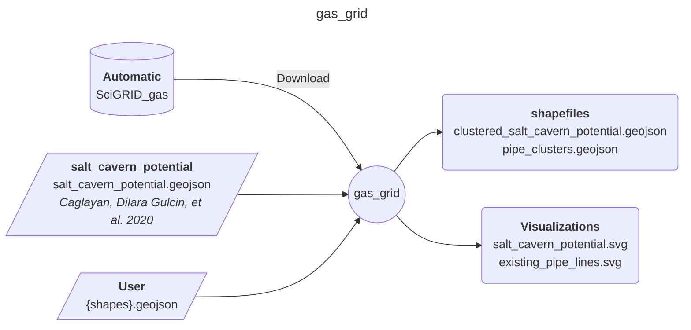

<!-- Please provide a concise summary of the module in this section. -->
<!-- --8<-- [start:intro] -->
# gas_network

A module to produce clusters of the exisiting gas grids in Europe. 

<!-- --8<-- [end:intro] -->

## Input-Output

<!-- Please fill in this diagram including: wildcards, user resources and final results. -->
<!-- --8<-- [start:mermaid] -->

<!-- --8<-- [end:mermaid] -->

### Wildcards
<!-- Please explain what wildcards are required by users here. -->
<!-- --8<-- [start:wildcards] -->

- **{shape}**: Determines the number of regions that the module will process. Any regional aggregation within Europe is possible.

<!-- --8<-- [end:wildcards] -->

<!-- data that should be there and cant be downloaded automatically? -->
### Necessary data
- **resource/salt_cavern/salt_cavern_potential.geojson**: Contains the potential energy storage capacity of the different salt cavern sites (offshore and onshore) in Europe, based on study carried out by *Caglayan, Dilara Gulcin, et al. 2020*.

### User
<!-- Please briefly explain user resources here. -->
<!-- --8<-- [start:user] -->

- **resources/user/{shapes}.geojson**: a file with the desired regional aggregation. CRS must be EPSG:4326.

<!-- --8<-- [end:user]  -->
### Result files
<!-- Please briefly explain final result files here. -->
<!-- --8<-- [start:results] -->

- **results/shapes/{shapes}/pipe_clusters.geojson**: clustered pipe lines of exisiting gas grid based on the user regions shape file.

- **results/shapes/{shapes}/clustered_salt_cavern_potential.geojson**: onshore and offshore salt cavern storage potentials per region based on the user regions shape file.

- **results/visualizations/{shapes}/salt_cavern_potential.svg**: visualiztion of the salt cavern storage potentials for onshore and offshore sites.

- **results/visualizations/{shapes}/existing_pipe_lines.svg**: visualization of different pipelines among the specified regions categorized based on the pipeline diameter.

<!-- --8<-- [end:results]  -->

## References
<!-- Please cite studies and datasets used for this workflow below. -->
<!-- --8<-- [start:references] -->

- J Diettrich et al. SciGRID Gas. Nov. 2020. URL: <https://www.gas.scigrid.de/downloads.html>

- Fabian Neumann, Elisabeth Zeyen, Marta Victoria, and Tom Brown. The potential role of a hydrogen network in Europe. 2022. <https://arxiv.org/abs/2207.05816>

- Jonas Hörsch, Fabian Hofmann, David Schlachtberger, and Tom Brown. Pypsa-eur: an open optimisation model of the European transmission system. Energy Strategy Reviews, 22:207–215, 2018.  <https://www.sciencedirect.com/science/article/abs/pii/S2211467X18300804?via%3Dihub>

- Dilara Gulcin Caglayan, Nikolaus Weber, Heidi U. Heinrichs, Jochen Linßen, Martin Robinius, Peter A. Kukla, Detlef Stolten, Technical potential of salt caverns for hydrogen storage in Europe, International Journal of Hydrogen Energy, Volume 45, Issue 11, 2020, Pages 6793-6805.
<https://doi.org/10.1016/j.ijhydene.2019.12.161>
<!-- --8<-- [end:references] -->
